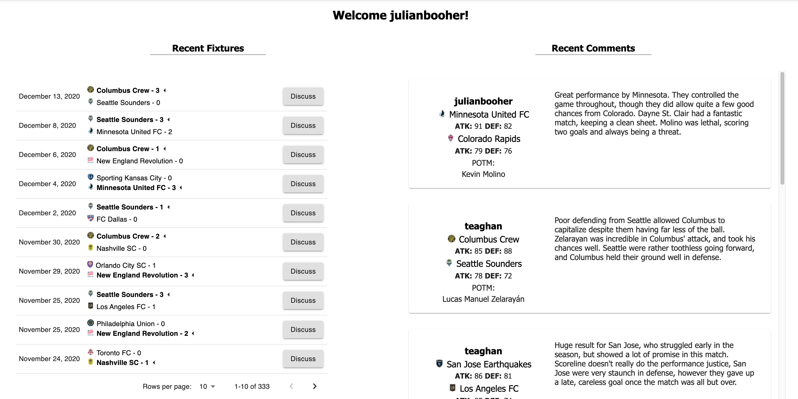
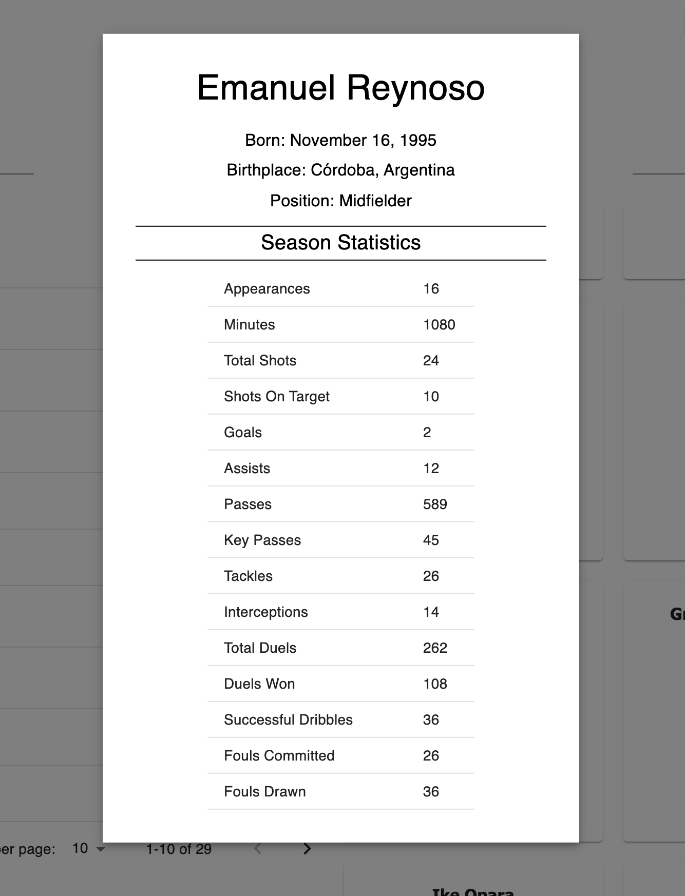

# Match Thread

## Description

_Duration: Two Weeks_

Web App that allows users to discuss and analyze soccer matches.

## Screen Shots

## Installation

** Coming Soon **

## Usage

- Home page is a list of the most recent fixtures, and recent comments.
- The user can navigate to a team page for a more detailed view of a specific team, or a fixtures page for a list of fixtures sorted by team.
- On the team page, the user can view detailed statistics about a player by clicking on their player card.
- When the user goes to an individual fixture page, they are allowed to enter a rating, comment, and a standout player for that fixture. Comments from other users will be displayed on the right.
- User page has basic user information, as well as recent comments from that user.

## Built With

HTML, CSS, Material-UI, JavaScript, React, React-Redux, React-Redux-Saga, postgresql, Node.js, axios, passport, moment.js. 

## Acknowledgement
Thanks to [Prime Digital Academy](www.primeacademy.io) who equipped and helped me to make this application a reality.